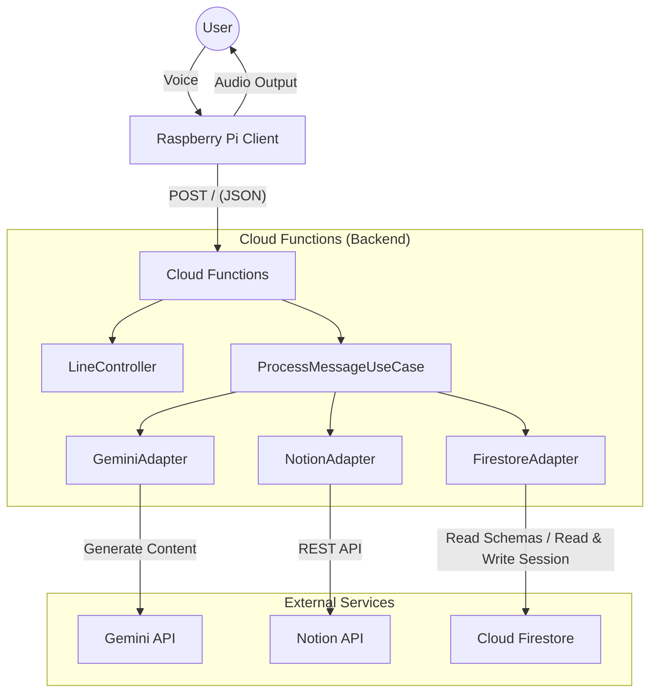
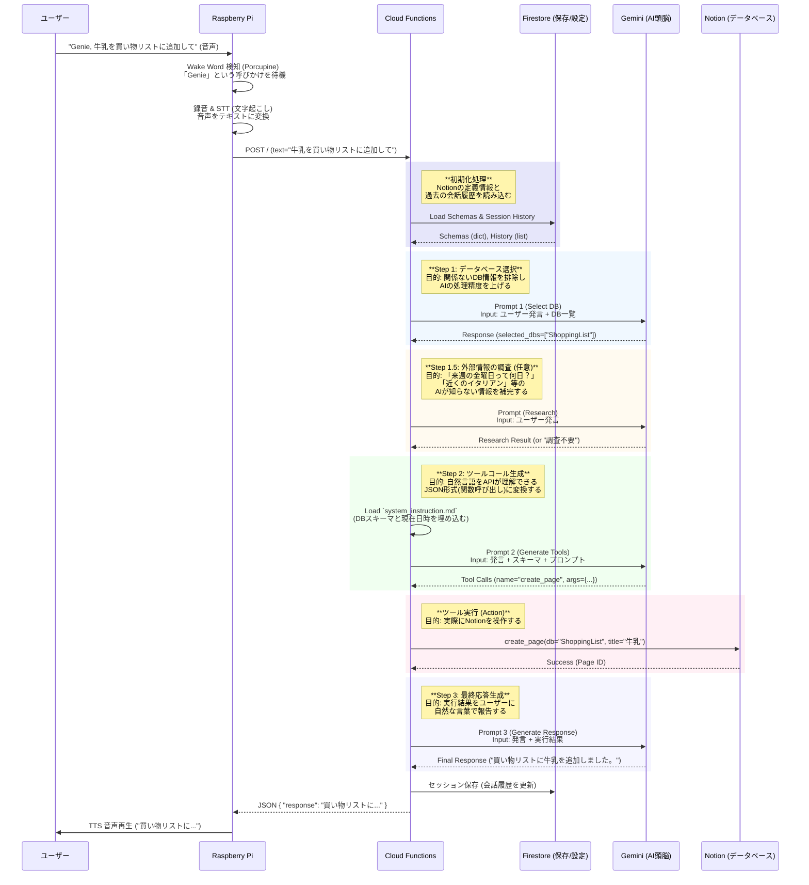

# NotiGenie システムアーキテクチャ設計書

## 1. システム概要

NotiGenieは、Raspberry Piを用いた音声対話型AIアシスタントです。ユーザーの音声指示を解析し、Notionデータベースの操作や情報の検索を行います。

### 主な機能

- **ハンズフリー起動**: "Genie" (または "Porcupine") というウェイクワードで起動。
- **音声対話**: ユーザーの発話を認識し、自然な日本語で応答。
- **Notion連携**: 買い物リストの追加、タスク管理、メモの記録などをNotion API経由で実行。
- **AIエージェント**: Gemini 2.5 モデルを使用し、ユーザーの意図を解釈して適切なツール（Notion操作）を選択・実行。

## 2. 全体アーキテクチャ

システムは大きく分けて「クライアント端末 (Raspberry Pi)」と「バックエンド (Google Cloud Functions)」の2層構造になっています。



### 2.1. クライアント端末 (Raspberry Pi)

- **責務**: 音声入出力、ウェイクワード検知、STT (Speech-to-Text)、TTS (Text-to-Speech)。
- **ディレクトリ**: `raspberry_pi/`
- **主要コンポーネント**:
  - `WakeWordEngine`: Picovoice Porcupineを使用し、ウェイクワードを待機。
  - `STTClient`: Google Cloud Speech-to-Text (または代替) を使用し、音声をテキスト化。
  - `TTSInterface`: 音声合成 (AquesTalk Pi, VoiceVox 等) を行い、応答を再生。
  - `app.py`: メインループ。ウェイクワード検知 -> 録音 -> STT -> バックエンド送信 -> TTS再生 を制御。

### 2.2. バックエンド (Google Cloud Functions)

- **責務**: 意図解釈、ツール実行判断、Notion操作、応答生成。
- **ディレクトリ**: `cloud_functions/`
- **アーキテクチャ**: クリーンアーキテクチャを採用。
  - **Core**: ビジネスロジック (`ProcessMessageUseCase`) とインターフェース定義。
  - **Interfaces/Gateways**: 外部サービス (Gemini, Notion, Firestore) へのアダプタ。
  - **Prompts**: LLMへの指示書 (`system_instruction.md` 等)。

## 3. 対話フローとLLMインタラクション (Sequence Diagram)

ユーザーの発話から応答生成までの詳細なフローは以下の通りです。Geminiとのやり取りは3ステップで行われます。

### 処理の全体像

このフローは、**「ユーザーの曖昧な指示を、システムが実行可能な明確な命令に変換し、実行結果を分かりやすく伝える」**ことを目的としています。



### 各プロンプトの目的と役割

AI（Gemini）への指示は、精度を確保するために段階を分けて行われます。

#### 1. データベース選択プロンプト (Step 1)

- **目的**: ユーザーの話している内容が、登録されているどのNotionデータベース（「買い物リスト」「タスク」「料理在庫」など）に関連するかを判断させます。
- **なぜ必要か**: すべてのデータベース定義を一度にAIに渡すと情報量が多すぎて、誤動作の原因になるためです。まず最初に関係あるDBだけを絞り込みます。

#### 2. プロンプトファイル (`system_instruction.md`) (Step 2)

- **目的**: 具体的なNotion操作（ページの作成、検索、更新など）を行うための指示書です。
- **内容**:
  - **現在の役割定義**: 「あなたはNotionデータベース管理アシスタントです」という基本設定。
  - **現在日時**: 「今日」や「来週」を具体的な日付に変換するために動的に埋め込まれます。
  - **データベース定義 (Schema)**: Step 1で選ばれたDBの構造（プロパティ名、選択肢など）が埋め込まれます。これがないと、AIは正しいJSONを作れません。
- **利用箇所**: Step 2の「ツールコール生成」時に、メインの指示として使用されます。

#### 3. 調査プロンプト (Step 1.5 - Grounding)

- **目的**: ユーザーの質問に答えるために、インターネット検索が必要かどうかを判断し、必要なら検索を実行させます。
- **例**: 「**来週の土曜日**にタスクを入れて」→ カレンダーで日付を調べる。「**渋谷の美味しいラーメン屋**をリストに入れて」→ 検索して店名や評価を取得する。

#### 4. 応答生成プロンプト (Step 3)

- **目的**: ツールを実行した結果（成功したか、検索結果は何だったか）を受け取り、ユーザーに対する最終的な返答を作成します。
- **特徴**: JSONなどの技術的な情報を排除し、人間味のある自然な日本語（「わかりました、追加しておきました！」など）に変換します。

## 4. コンポーネント詳細設計

### 4.1. Notion Integration (`NotionAdapter`)

- **方式**: Notion SDK for Python (`notion-client`) を使用した直接APIコール。
- **機能**:
  - `search_database`: タイトル検索およびプロパティフィルタリング。
  - `create_page`: 新規ページ作成。
  - `update_page`: ページプロパティ更新。
  - `append_block`: ページ本文への追記。
- **設定**: Firestore から読み込まれたスキーマ情報に基づき、論理データベース名とUUIDのマッピング、プロパティ型の解決を行います。

### 4.2. Wake Word Handler (`WakeWordEngine`)

- **方式**: Picovoice Porcupine (軽量・高精度なオンデバイス・ウェイクワードエンジン)。
- **スレッドモデル**: 音声監視ループはメインスレッドまたは別スレッドで実行され、検知時にコールバックを発火します。
- **リソース管理**: マイク入力 (`pvrecorder`) とエンジンリソースの確実な解放 (`cleanup`) を実装。

### 4.3. Session & Config Management (`FirestoreAdapter`)

- **方式**: Google Cloud Firestore (NoSQL Document Database)。
- **機能**:
  - **設定管理**: Notionデータベースのスキーマ定義（論理名、UUID、プロパティ構造）を `notion_schemas` コレクションに保存・読み込み。これにより、コードを変更せずにDB定義を更新可能にします。
  - **セッション管理**: ユーザーごとの会話履歴を `chat_sessions` コレクションに保存。文脈を維持した対話を実現しつつ、一定時間経過後の履歴破棄も行います。

#### 会話履歴の管理方針

会話の文脈を維持しつつ、コストとプライバシーに配慮した設計となっています。

1.  **保存期間**: 最後の会話から **5分間** (`SESSION_HISTORY_LIMIT_MINUTES`) 保持されます。これを超えるとセッションは期限切れとみなされ、新しいコンテキストで会話が始まります。
2.  **履歴の長さ**: 最新の **20ターン** (ユーザー発言1回+AI応答1回で1ターン換算、計40メッセージ) までを保持します。古いメッセージから順に削除されます。
3.  **ユーザー識別**:
    - **Raspberry Pi経由**: 現行バージョンでは「端末」単位での識別となります。`default_api_session` という固定IDを使用しており、家族で共有する形になります。
    - **LINE経由**: LINEの「ユーザーID」をセッションIDとして使用するため、**ユーザーごとに個別の会話履歴**が保持されます。プライベートなタスク管理なども可能です。
    - _注: 将来的にはRaspberry Piでも話者認識（声紋認証）などでユーザーを個別に識別する機能を検討中です。_

## 5. TTS エンジンの切り替え

### 5.1. 概要

クライアントは複数のTTSエンジンをサポートしており、環境変数で切り替え可能です。

| エンジン    | 説明                                                         | 速度 |
| :---------- | :----------------------------------------------------------- | :--- |
| `aquestalk` | AquesTalk Pi（ゆっくりボイス）。軽量でリアルタイム発話可能。 | ★★★  |
| `voicevox`  | VoiceVOX（ずんだもん等）。高品質だがPi 3では50秒程度かかる。 | ★☆☆  |

### 5.2. 切り替え方法

`.env` ファイルで設定します。

- **TTS_ENGINE=aquestalk**: 低負荷でレスポンスが高速。Raspberry Pi 3以前や、リソースを節約したい場合に最適。
- **TTS_ENGINE=voicevox**: 高品質ですが、Raspberry Pi 4以上を推奨。

> [!NOTE]
> 現在、デプロイ高速化のため VoiceVOX エンジンはデフォルトで `docker-compose.yml` 内でコメントアウトされています。
> VoiceVOX を使用する場合は、`raspberry_pi/docker-compose.yml` の `voicevox_core` サービスのコメントアウトを解除し、`.env` の `TTS_ENGINE` を `voicevox` に変更してください。

変更後、コンテナを再起動してください。

```bash
docker compose restart client
```

### 5.3. VoiceVOX の高速化

VoiceVOX を高速に使いたい場合は、より高性能なPC上でエンジンを実行し、以下の環境変数でホストを指定します。

```bash
VOICEVOX_HOST=192.168.1.100  # VoiceVOX Engine が動作しているPCのIP
TTS_ENGINE=voicevox
```

## 6. 今後の拡張性

- **マルチユーザー対応**: 現在は単一セッションIDで運用されていますが、リクエストボディに動的な `session_id` を含めることで、家族それぞれの個人アカウントや文脈を使い分けることが可能です。
- **通知機能**: 現在は「ユーザーからの問いかけ」に対する応答が主ですが、将来的にはCloud Scheduler等を用いて定期的にNotionをチェックし、LINE等にプッシュ通知を送る機能を追加可能です。
- **マルチモーダル**: 画像入力への対応などもGeminiの機能拡張に伴い可能です。
