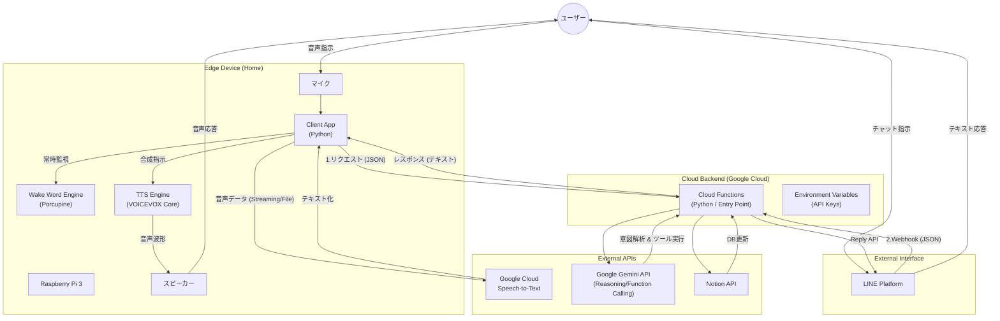
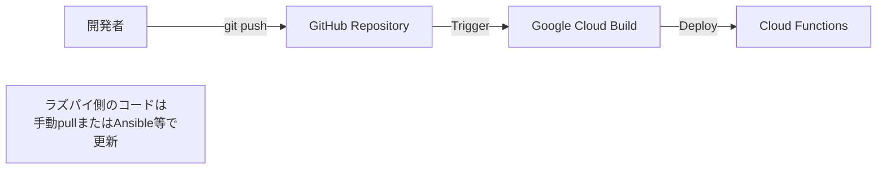

# Notion 音声操作アシスタント 要件定義書 (v1.1)

## 1. プロジェクト概要

### 1.1 目的

音声（Raspberry Pi）およびチャット（LINE）というマルチモーダルなインターフェースを通じて、ユーザーの自然言語による指示を解析し、Notion データベース（タスク管理等）を自動更新するシステムを構築する。

### 1.2 ゴール

- **音声操作:** 「ヘイ、ラズパイ」等のウェイクワードで起動し、話しかけるだけで Notion へタスク登録ができる。
- **音声応答:** 処理結果を VOICEVOX（ずんだもん）の声でフィードバックする。
- **チャット操作:** 外出先からは LINE で同様の操作ができる。
- **保守性:** ロジックをクラウドに集約し、一箇所へのデプロイで全端末の脳みそを更新できる状態にする。

---

## 2. システムアーキテクチャ

### 2.1 全体構成図 (Mermaid)



### 2.2 CI/CD パイプライン



---

## 3\. 技術スタックと選定理由

| コンポーネント      | 技術選定                        | 選定理由・備考                                                                                            |
| :------------------ | :------------------------------ | :-------------------------------------------------------------------------------------------------------- |
| **Edge H/W**        | Raspberry Pi 3                  | ユーザー既存資産。音声処理と軽量な Python スクリプトなら十分動作可能。                                    |
| **Wake Word**       | Picovoice (Porcupine)           | **軽量・高精度。** Pi 3 のリソースでも常時監視が可能であり、誤検知が少ない。実装も容易。                  |
| **STT (音声認識)**  | **Google Cloud Speech-to-Text** | **変更点。** Google エコシステムでの統一。高い日本語認識精度とストリーミング認識への拡張性を持つ。        |
| **Logic / Backend** | Google Cloud Functions (Python) | **サーバーレス・低コスト。** LINE とラズパイの共通バックエンドとして最適。Gemini との親和性も高い。       |
| **AI / Agent**      | Gemini 1.5 Flash                | **Function Calling 対応。** 高速かつ安価。Notion 操作のための構造化データ抽出に利用。                     |
| **Database**        | Notion                          | ユーザー要望。情報の集約先。                                                                              |
| **TTS (音声合成)**  | VOICEVOX (ずんだもん)           | **Linux(ARM)対応。** ユーザー要望のキャラクターボイスかつ、Pi 3 上でローカル動作（VOICEVOX Core）が可能。 |
| **Messenger**       | LINE Messaging API              | 日本国内での利便性が最も高い UI として採用。                                                              |
| **Repository**      | GitHub (Monorepo)               | バックエンドとクライアントのコード整合性を保つため単一リポジトリで管理。                                  |

---

## 4\. 機能要件

### 4.1 クラウド側 (Cloud Functions)

- **インターフェース統合:**
  - HTTP リクエスト（ラズパイから）と LINE Webhook（LINE から）の両方を受け付ける。
  - リクエスト元を判別し、LINE の場合は `line_handler` モジュールへ処理を委譲する。
- **意図解析 (Gemini):**
  - 入力テキストから「ユーザーが何をしたいか」を判断する。
- **Notion 操作:**
  - 解析結果に基づき、指定の Notion データベースにページを追加・更新する。
- **ステートレス設計:**
  - 1 回のリクエストで完結する設計とする（DB による会話履歴保持はフェーズ 2 以降）。

### 4.2 エッジ側 (Raspberry Pi 3)

- **ウェイクワード検知:**
  - マイク入力を常時監視し、「Notion（または任意の言葉）」を検知したら録音フェーズへ移行する。
- **音声認識 (STT):**
  - 検知後、音声を録音し **Google Cloud Speech-to-Text API** へ送信、テキストを取得する。
  - 認証にはサービスアカウントキー（JSON）を使用する。
- **バックエンド連携:**
  - 取得したテキストを Cloud Functions へ送信する。
- **音声合成 (TTS):**
  - Cloud Functions から戻ってきたテキストを、ローカルの VOICEVOX Core エンジンで「ずんだもん」の音声に変換して再生する。

### 4.3 LINE Bot

- テキストメッセージを受け取り、クラウド側で処理された結果を返信する。
- 署名検証（Security）を行い、不正なリクエストを拒否する。

---

## 5\. ディレクトリ構成案 (Repository Structure)

LINE 連携ロジックを明示的に分離し、保守性を高めた構成とします。

```text
notion-voice-assistant/
├── .github/
│   └── workflows/
│       └── deploy.yml          # Cloud Functions自動デプロイ設定
├── cloud_functions/            # [Backend] Google Cloud Functions配備用
│   ├── main.py                 # エントリーポイント (振り分け処理)
│   ├── line_handler.py         # [New] LINE Webhook処理・署名検証・返信ロジック
│   ├── notion_handler.py       # Notion API操作ロジック
│   ├── gemini_agent.py         # Gemini Function Calling定義
│   └── requirements.txt        # 依存ライブラリ (line-bot-sdk等)
├── raspberry_pi/               # [Client] Pi 3用
│   ├── app.py                  # メインスクリプト
│   ├── wake_word_engine.py     # Porcupineラッパー
│   ├── voicevox_client.py      # VOICEVOX操作モジュール
│   ├── stt_client.py           # [Update] Google Cloud STTラッパー
│   ├── resources/              # 効果音やモデルファイル
│   └── requirements.txt
├── docs/                       # 設計書・メモ
│   └── architecture.md         # 本ファイル
└── README.md
```

---

## 6\. 開発ロードマップ

1.  **フェーズ 1: クラウドロジック開発 (Core Logic)**
    - Notion API 疎通確認
    - Gemini Function Calling 実装
    - Cloud Functions デプロイ & 動作確認
2.  **フェーズ 2: LINE Bot 連携**
    - LINE Developers 設定
    - `line_handler.py` の実装
    - Cloud Functions に LINE Webhook 処理を追加
    - 実機(スマホ)でのチャット動作確認
3.  **フェーズ 3: Raspberry Pi 実装**
    - マイク・スピーカー設定
    - Porcupine (ウェイクワード) 導入
    - **Google Cloud STT** 連携 (サービスアカウントキー設定)
    - VOICEVOX (Core/Docker) 導入
    - Cloud Functions との結合テスト
4.  **フェーズ 4: 運用・改善**
    - プロンプト調整
    - ステートフル化（必要に応じて Firestore 導入）

---

## 7\. 懸念点と対策

- **Google Cloud STT の認証:**
  - ラズパイ上に GCP のサービスアカウントキー（JSON ファイル）を安全に配置する必要があります。
  - **対策:** `.gitignore` に登録し、GitHub には絶対にアップロードしない運用を徹底します。
- **VOICEVOX の負荷 (Pi 3):**
  - Pi 3 では動作が重くなるリスクがあります。
  - **対策:** 軽量な VOICEVOX Core を使用し、CPU 使用率を監視します。
