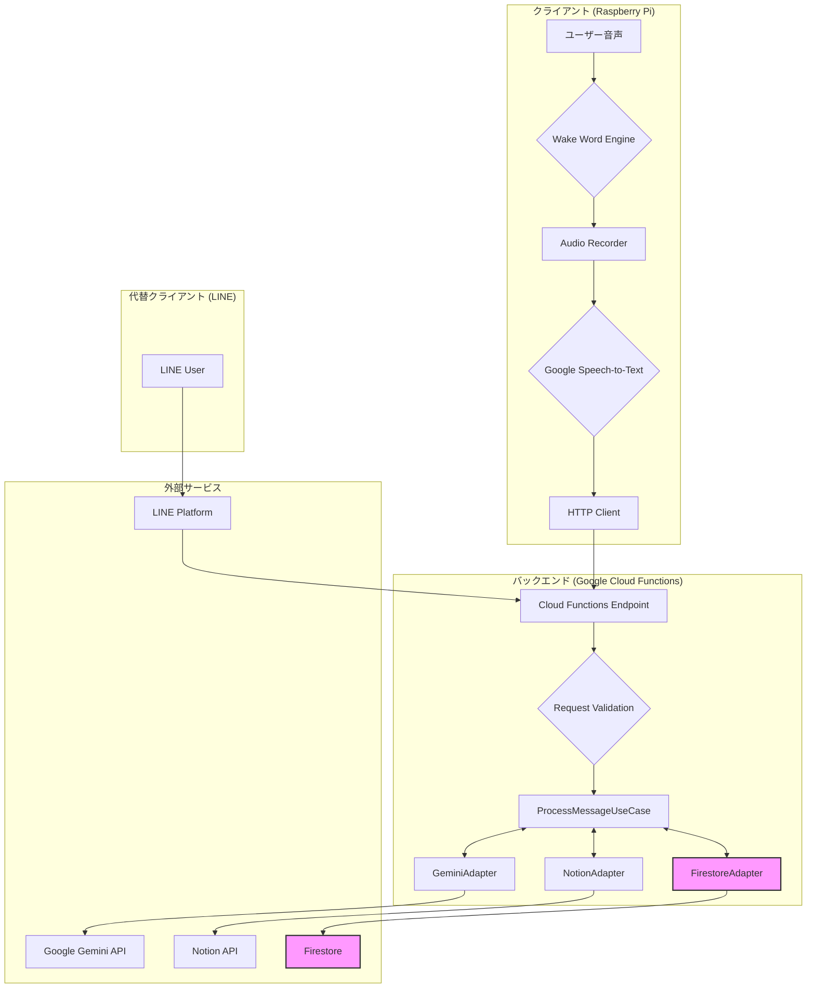

# アーキテクチャ設計書

## 1. 概要

本システムは、Raspberry Piをクライアント、Google Cloud Functionsをバックエンドとした音声アシスタントアプリケーションです。
ユーザーからの音声をトリガーに、自然言語処理(LLM)を用いて意図を解釈し、Notionデータベースと連携してタスク管理などを行います。

## 2. 全体構成図



## 3. 主要コンポーネントの役割

### 3.1. クライアント (Raspberry Pi)

ユーザーとの物理的なインターフェースを担当します。

- **Wake Word Engine**: 特定のキーワード（例：「ねぇ、ジニー」）を検知してシステムを起動します。
- **Audio Recorder**: ユーザーの音声を録音します。
- **Google Speech-to-Text (STT)**: 録音された音声をテキストに変換します。
- **HTTP Client**: 変換されたテキストをバックエンドのCloud Functionsに送信し、応答を待機します。
- **Text-to-Speech (TTS)**: バックエンドから受け取ったテキスト応答を音声に変換して再生します。

### 3.2. バックエンド (Google Cloud Functions)

システムのコアロジックを担当し、クリーンアーキテクチャを採用しています。

- **`main.py` (Entry Point)**:
  - Raspberry PiやLINE PlatformからのHTTPリクエストを受け付けます。
  - 依存性の注入(DI)を行い、各コンポーネントを初期化します。
  - リクエストの種類に応じて処理を振り分けます。

- **`ProcessMessageUseCase` (Use Case Layer)**:
  - ビジネスロジックの中心的な役割を担います。
  - `GeminiAdapter` を通じてLLMとの対話をオーケストレーションします。
  - `NotionAdapter` から提供されるツール（Function Calling）をLLMに提示します。
  - `FirestoreAdapter` を使って会話履歴を管理します。

- **`GeminiAdapter` (Infrastructure Layer)**:
  - Google Gemini APIとの通信を担当します。
  - Function Calling（ツール呼び出し）の機能を有効化し、LLMがNotionを操作できるようにします。
  - Firestoreから取得したNotionのDBスキーマ情報をシステムプロンプトに含め、LLMにコンテキストを提供します。

- **`NotionAdapter` (Infrastructure Layer)**:
  - Notion APIとの通信を担当します。
  - `search_database`, `create_page`, `update_page` など、具体的なDB操作メソッドをツールとして `ProcessMessageUseCase` に提供します。

- **`FirestoreAdapter` (Infrastructure Layer)**:
  - Google Firestoreとの通信を担当します。
  - 会話履歴の永続化と読み込みを行います。
  - アプリケーションが使用するNotionデータベースのスキーマ情報を管理します。

### 3.3. 外部サービス

- **Google Gemini API**: 自然言語理解と応答生成、Function Callingの判断を行います。
- **Notion API**: タスクやメモなどのデータを格納するデータベースです。
- **Firestore**: 会話履歴とNotionのスキーマ情報を格納します。
- **LINE Platform**: 代替クライアントとして、LINEアプリ経由での対話を実現します。

## 4. TTS エンジンの切り替え

### 4.1. 概要

クライアントは複数のTTSエンジンをサポートしており、環境変数で切り替え可能です。

| エンジン    | 説明                                                         | 速度 |
| :---------- | :----------------------------------------------------------- | :--- |
| `aquestalk` | AquesTalk Pi（ゆっくりボイス）。軽量でリアルタイム発話可能。 | ★★★  |
| `voicevox`  | VoiceVOX（ずんだもん等）。高品質だがPi 3では50秒程度かかる。 | ★☆☆  |

### 4.2. 切り替え方法

`.env` ファイルの- **TTS_ENGINE=voicevox**: 高品質ですが、Raspberry Pi 4以上を推奨。

- **TTS_ENGINE=aquestalk**: 低負荷でレスポンスが高速。Raspberry Pi 3以前や、リソースを節約したい場合に最適。

> [!NOTE]
> 現在、デプロイ高速化のため VoiceVOX エンジンはデフォルトで `docker-compose.yml` 内でコメントアウトされています。
> VoiceVOX を使用する場合は、`raspberry_pi/docker-compose.yml` の `voicevox_core` サービスのコメントアウトを解除し、`.env` の `TTS_ENGINE` を `voicevox` に変更してください。
> TTS_ENGINE=voicevox

変更後、コンテナを再起動してください。

```bash
docker compose restart client
```

### 4.3. VoiceVOX の高速化

VoiceVOX を高速に使いたい場合は、より高性能なPC上でエンジンを実行し、以下の環境変数でホストを指定します。

```bash
VOICEVOX_HOST=192.168.1.100  # VoiceVOX Engine が動作しているPCのIP
TTS_ENGINE=voicevox
```
