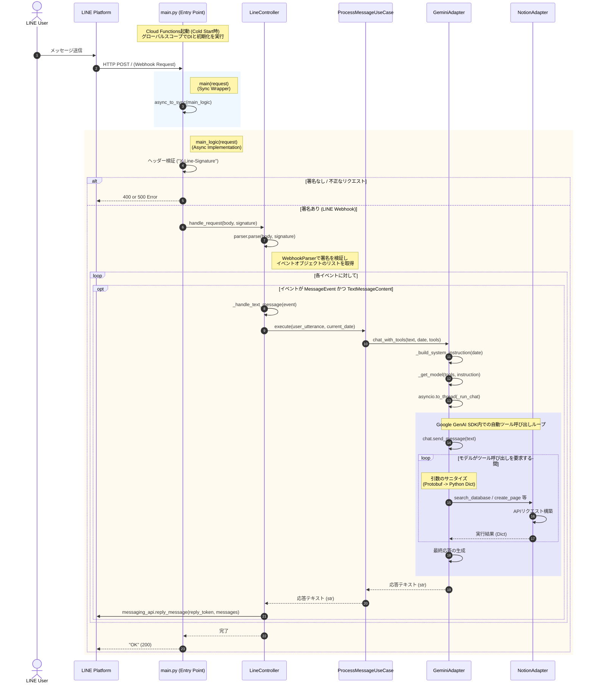

# LINE Webhook処理シーケンス図

この図は、ユーザーがLINEでメッセージを送信してから、Cloud Functionsが応答を返すまでの処理フローを示しています。
Clean Architectureに基づき、コントローラー、ユースケース、ゲートウェイ（アダプター）が連携して動作します。

```mermaid
sequenceDiagram
    autonumber
    actor User as LINE User
    participant LINE as LINE Platform
    participant Main as main.py (Entry Point)
    participant LC as LineController
    participant UC as ProcessMessageUseCase
    participant Gemini as GeminiAdapter
    participant Notion as NotionAdapter

    Note over Main: Cloud Functions起動 (Cold Start時)<br/>グローバルスコープでDIと初期化を実行

    User->>LINE: メッセージ送信
    LINE->>Main: HTTP POST / (Webhook Request)

    rect rgb(240, 248, 255)
        Note right of Main: main(request)<br/>(Sync Wrapper)
        Main->>Main: async_to_sync(main_logic)
    end

    rect rgb(255, 250, 240)
        Note right of Main: main_logic(request)<br/>(Async Implementation)

        Main->>Main: ヘッダー検証 ("X-Line-Signature")

        alt 署名なし / 不正なリクエスト
            Main-->>LINE: 400 or 500 Error
        else 署名あり (LINE Webhook)
            Main->>LC: handle_request(body, signature)

            LC->>LC: parser.parse(body, signature)
            Note right of LC: WebhookParserで署名を検証し<br/>イベントオブジェクトのリストを取得

            loop 各イベントに対して
                opt イベントが MessageEvent かつ TextMessageContent
                    LC->>LC: _handle_text_message(event)

                    # ユースケースの実行
                    LC->>UC: execute(user_utterance, current_date)

                    # LLMとの対話開始
                    UC->>Gemini: chat_with_tools(text, date, tools)
                    Gemini->>Gemini: _build_system_instruction(date)
                    Gemini->>Gemini: _get_model(tools, instruction)

                    # 同期メソッドを非同期スレッドで実行
                    Gemini->>Gemini: asyncio.to_thread(_run_chat)

                    rect rgb(230, 230, 250)
                        Note over Gemini, Notion: Google GenAI SDK内での自動ツール呼び出しループ
                        Gemini->>Gemini: chat.send_message(text)

                        loop モデルがツール呼び出しを要求する間
                            Note over Gemini: 引数のサニタイズ<br/>(Protobuf -> Python Dict)
                            Gemini->>Notion: search_database / create_page 等
                            Notion->>Notion: APIリクエスト構築
                            Notion-->>Gemini: 実行結果 (Dict)
                        end

                        Gemini->>Gemini: 最終応答の生成
                    end

                    Gemini-->>UC: 応答テキスト (str)
                    UC-->>LC: 応答テキスト (str)

                    # ユーザーへの返信
                    LC->>LINE: messaging_api.reply_message(reply_token, messages)
                end
            end

            LC-->>Main: 完了
            Main-->>LINE: "OK" (200)
        end
    end
```
