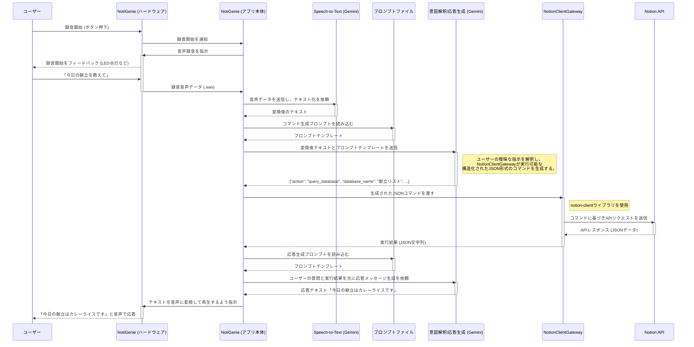

# アプリケーション全体フロー設計書

## 1. 概要

本ドキュメントは、NotiGenieアプリケーションにおけるユーザーとの会話からNotionデータベースへのアクセス、そしてユーザーへの応答までの一連の全体フローについて設計を記述する。

## 2. 目的

アプリケーションの主要な機能がどのように連携し、ユーザーの要求を処理するかを明確にする。特に、AI（Gemini）と外部サービス（Notion API）との連携、および各コンポーネントの責務を可視化する。

## 3. 全体フロー

### 3.1. シーケンス図

### 3.2. 各ステップの詳細

1.  **音声入力と録音:** ユーザーがボタンを押し、NotiGenieに録音開始を指示します。
2.  **音声認識:** アプリケーションが音声をテキストに変換する。
3.  **プロンプトの準備:** アプリケーションがプロンプトテンプレートと`config.yaml`の情報を結合する。
4.  **コマンド生成 (Gemini):** Geminiがユーザーの指示を解釈し、Notion操作のためのJSONコマンドを生成する。
5.  **コマンドの解析とマッピング:** アプリケーションがJSONを解析し、`database_name`を`config.yaml`に基づき実際のIDに変換する。
6.  **NotionClientGatewayによるツール実行:** `NotionClientGateway`が、`notion-client`ライブラリを直接使ってNotion APIを呼び出す。
7.  **実行結果の取得:** Notion APIからの結果がゲートウェイ経由でアプリケーションに返される。
8.  **応答メッセージ生成 (Gemini):** アプリケーションが「ユーザーの元の質問」と「Notionの実行結果」をGeminiに渡し、自然言語の応答を生成させる。
9.  **音声による応答:** 生成されたテキストを音声に変換し、ユーザーにフィードバックする。

### 3.3. NotionMCP 利用可能ツール一覧

`mcp-notion`サーバーが提供する、利用可能なツール（`action`）の一覧です。

| ツール名 (`action`) | 説明 | 主な引数 | NotiGenieでの利用 |
| :--- | :--- | :--- | :--- |
| `query_database` | データベース内のページを検索（フィルター、ソート可） | `database_id`, `filter_json` | ◎ (メイン利用) |
| `create_page` | 新しいページを作成します。 | `parent_id`, `properties_json` | ◎ (メイン利用) |
| `update_page` | 既存のページのプロパティを更新します。 | `page_id`, `properties_json` | ○ (将来利用) |
| `get_database` | 特定のデータベース自体の情報を取得します。 | `database_id` | ○ (将来利用) |
| `get_page` | 特定の1ページの情報を取得します。 | `page_id` | △ (限定的に利用) |
| `append_blocks` | ページにコンテンツ（ブロック）を追加します。 | `block_id`, `blocks_json` | △ (限定的に利用) |
| `get_block_children` | ページやブロックの中身（子ブロック）を取得します。 | `block_id` | △ (限定的に利用) |
| `search_notion` | Notionのコンテンツ全体を検索します。 | `query` | × (利用しない) |

- **◎ (メイン利用):** アプリケーションのコア機能で頻繁に使用するツール。
- **○ (将来利用):** 今後の機能拡張での利用が想定されるツール。
- **△ (限定的に利用):** 特定の高度な機能で利用する可能性があるツール。
- **× (利用しない):** 現在のNotiGenieの要件では利用しないツール。

## 4. 各コンポーネントの役割

-   **ユーザー:** アプリケーションに音声で指示を出す。
-   **NotiGenie (ハードウェア):** Raspberry Pi上の物理インターフェース。ボタン、マイク、スピーカーなどを制御する。
-   **NotiGenie (アプリ本体):** 全体の処理フローを制御するコアアプリケーション。
-   **Speech-to-Text (Gemini):** 受け取った音声データをテキストに変換する。
-   **プロンプトファイル:** Geminiに与える指示（プロンプト）を管理する外部ファイル。コードと分離することで、迅速な改善サイクルを可能にする。
-   **意図解釈/応答生成 (Gemini):** 「頭脳」の役割。ユーザーの曖昧な自然言語を解釈し、NotionClientGatewayが実行できる厳密な**構造化された命令（JSON）**を生成したり、実行結果を自然な言葉に要約したりする。
-   **NotionClientGateway:** `notion-client`ライブラリのラッパーとして機能し、Notion APIとの実際の通信を代行する。APIの技術的な詳細を隠蔽し、アプリケーションの他の部分をシンプルに保つ。
-   **Notion API:** Notionデータベースの実際のCRUD操作を行うエンドポイント。

## 5. 考慮事項

-   **プロンプトの外部ファイル化:** Geminiに与える指示は、改善を繰り返すためにコードベースから分離された外部ファイルとして管理する。
-   **明確な命令フォーマット(JSON)の定義:** GeminiとNotionClientGateway間の「共通言語」となるJSONの仕様を厳密に定義する。
-   **データベースIDのマッピング:** `config.yaml`のようなGit管理対象外の設定ファイルで、論理名と実際のデータベースIDのマッピングを管理する。
-   **エラーハンドリング:** 各API呼び出しやツール実行時のエラーを適切に処理し、ユーザーに分かりやすいフィードバックを提供する。
-   **セキュリティ:** APIキーや認証情報などの機密情報は、環境変数や安全な設定ファイルで管理し、ソースコードに直接記述しない。