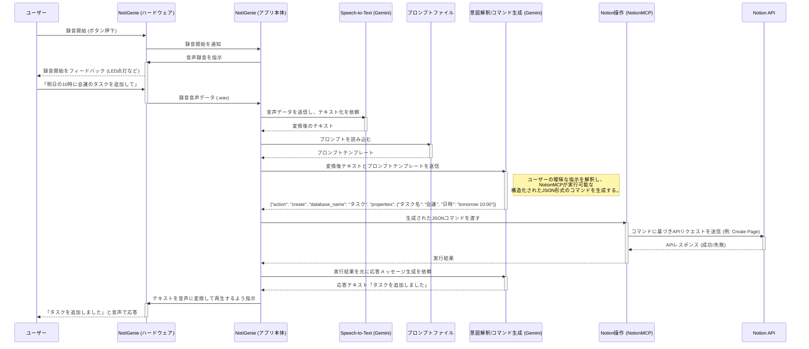

# アプリケーション全体フロー設計書

## 1. 概要

本ドキュメントは、NotiGenieアプリケーションにおけるユーザーとの会話からNotionデータベースへのアクセス、そしてユーザーへの応答までの一連の全体フローについて設計を記述する。

## 2. 目的

アプリケーションの主要な機能がどのように連携し、ユーザーの要求を処理するかを明確にする。特に、AI（Gemini）と外部サービス（NotionMCP）との連携、および各コンポーネントの責務を可視化する。

## 3. 全体フロー

### 3.1. シーケンス図

### 3.2. 各ステップの詳細

1.  **音声入力と録音:**
    -   ユーザーがボタンを押すなどして、NotiGenieに録音開始を指示します。
    -   NotiGenieは、マイクでユーザーの音声を受け取り、音声データとして保存します。

2.  **音声認識 (Speech-to-Text):**
    -   NotiGenieアプリケーションが音声データをGoogle Cloud Speech-to-Text APIに送信し、テキストに変換します。

3.  **プロンプトの準備:**
    -   アプリケーションは、`src/prompts/notion_command_generator.md`からプロンプトのテンプレートを読み込みます。
    -   `config.yaml`から利用可能なデータベースのリストと概要を読み込み、プロンプトテンプレートに埋め込みます。

4.  **コマンド生成 (Gemini):**
    -   アプリケーションは、音声認識で得られたテキストと、準備したプロンプトをGemini APIに送信します。
    -   Geminiは、ユーザーの指示を解釈し、NotionMCPが実行できる厳密なJSON形式のコマンドを生成して返します。

5.  **コマンドの解析とマッピング:**
    -   アプリケーションは、Geminiから返されたJSONコマンドを解析します。
    -   コマンドに含まれる`database_name`（例：「買い物リスト」）を、`config.yaml`のマッピングを基に実際のNotionデータベースIDに変換します。

6.  **NotionMCPによるツール実行:**
    -   アプリケーションは、変換されたデータベースIDを含むコマンドをNotionMCPサーバーに送信し、ツールの実行を要求します。
    -   NotionMCPは、受け取ったコマンドに基づいてNotion APIを呼び出し、データベースを操作します。

7.  **実行結果の取得:**
    -   NotionMCPは、Notion APIからの実行結果（成功、失敗、取得したデータなど）をアプリケーションに返します。

8.  **応答メッセージ生成 (Gemini):**
    -   アプリケーションは、NotionMCPからの実行結果を基に、ユーザーにフィードバックするためのプロンプトを生成し、再度Gemini APIに送信します。
    -   Geminiは、実行結果を人間が理解しやすい自然な文章（例：「買い物リストに牛乳を追加しました」）に変換して返します。

9.  **音声による応答 (Text-to-Speech):**
    -   アプリケーションは、Geminiが生成した応答メッセージをText-to-Speechライブラリで音声に変換し、スピーカーから再生します。

## 4. 各コンポーネントの役割

-   **ユーザー:** アプリケーションに音声で指示を出す。
-   **NotiGenie (ハードウェア):** Raspberry Pi上の物理インターフェース。ボタン、マイク、スピーカーなどを制御する。
-   **NotiGenie (アプリ本体):** 全体の処理フローを制御するコアアプリケーション。
-   **Speech-to-Text (Gemini):** 受け取った音声データをテキストに変換する。
-   **プロンプトファイル:** Geminiに与える指示（プロンプト）を管理する外部ファイル。コードと分離することで、迅速な改善サイクルを可能にする。
-   **意図解釈/コマンド生成 (Gemini):** 「頭脳」の役割。ユーザーの曖昧な自然言語を解釈し、NotionMCPが実行できる厳密な**構造化された命令（JSON）**を生成する。
-   **NotionMCP:** 「手足」の役割。Geminiから**構造化された命令**を受け取り、Notion APIとの実際の通信を代行する。APIの技術的な詳細を隠蔽し、アプリケーションの他の部分をシンプルに保つ。
-   **Notion API:** Notionデータベースの実際のCRUD操作を行うエンドポイント。

## 5. 考慮事項

-   **プロンプトの外部ファイル化:** Geminiに与える指示は、改善を繰り返すためにコードベースから分離された外部ファイルとして管理する。
-   **明確な命令フォーマット(JSON)の定義:** GeminiとNotionMCP間の「共通言語」となるJSONの仕様を厳密に定義する。
-   **データベースIDのマッピング:** `config.yaml`のようなGit管理対象外の設定ファイルで、論理名と実際のデータベースIDのマッピングを管理する。
-   **エラーハンドリング:** 各API呼び出しやツール実行時のエラーを適切に処理し、ユーザーに分かりやすいフィードバックを提供する。
-   **セキュリティ:** APIキーや認証情報などの機密情報は、環境変数や安全な設定ファイルで管理し、ソースコードに直接記述しない。