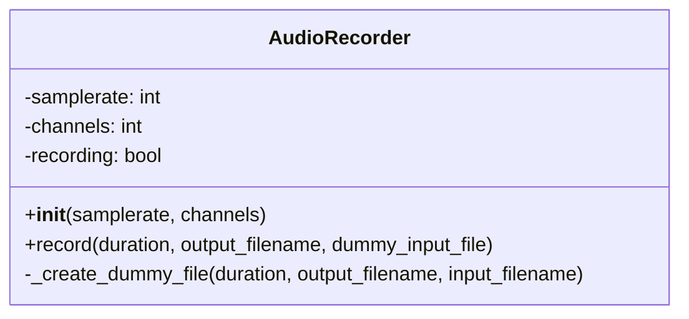

# 音声録音ハンドラ (`AudioRecorder`) 設計書

## 1. 概要

本ドキュメントは、マイクからの音声を録音し、ファイルとして保存する`AudioRecorder`クラスの設計について記述する。
このクラスは、開発ロードマップのタスク「[P1-1.1.2] マイクから音声データを録音し、ファイルとして保存する機能を実装」に対応する。

## 2. 目的

マイクからの音声入力処理を抽象化し、アプリケーションの他の部分がハードウェアやライブラリを意識することなく、「指定時間録音してファイルに保存する」という機能を簡単に利用できるようにする。

## 3. クラス設計

### 3.1. クラス名

`AudioRecorder`

### 3.2. 責務

- 指定されたサンプリングレートとチャンネル数で音声を録音する。
- 録音した音声データをWAVファイル形式で保存する。
- マイクが利用できない環境でも、ダミーの音声ファイル（無音）を生成してプログラムがエラーなく動作するようにする。

### 3.3. パブリックインターフェース



| メソッド/プロパティ | 引数 | 戻り値 | 説明 |
| :--- | :--- | :--- | :--- |
| `__init__(self, samplerate, channels)` | `samplerate` (int): サンプリングレート(Hz)。<br>`channels` (int): チャンネル数(1:モノラル, 2:ステレオ)。 | `None` | コンストラクタ。録音の基本設定を初期化する。 |
| `record(self, duration, output_filename)` | `duration` (int): 録音時間(秒)。<br>`output_filename` (str): 保存するWAVファイル名。 | `None` | 指定された時間録音し、ファイルに保存する。 |

### 3.4. 依存ライブラリ

- `sounddevice`: OSのサウンドデバイス（マイク、スピーカー）にアクセスするためのライブラリ。
- `scipy`: 科学技術計算ライブラリ。ここでは、Numpy配列の音声データをWAVファイルに書き出すために`scipy.io.wavfile.write`を使用する。
- `numpy`: 数値計算ライブラリ。音声データはNumpy配列として扱われる。

## 4. 互換性（ダミーモード）

マイクが接続されていない開発環境でもアプリケーションのテストができるように、ダミーモードを実装する。

- **実装方法:**
    1. スクリプトの初期読み込み時に`sounddevice.query_devices()`を呼び出し、利用可能な入力デバイス（マイク）が存在するかを確認する。
    2. マイクが存在しない場合、`IS_MICROPHONE_AVAILABLE`フラグを`False`に設定する。
    3. `record`メソッドが呼び出された際に、このフラグをチェックする。
    4. `False`の場合、実際の録音処理は行わず、代わりに指定された時間分の無音のNumpy配列を生成し、それをWAVファイルとして書き出すことでダミーファイルを作成する。

- **利点:**
    - マイクがない環境でも、録音機能に続く後続の処理（文字起こしAPIへの送信など）のロジックをテストすることができる。

## 5. 使用例

```python
from hardware.audio_recorder import AudioRecorder

# レコーダーを初期化
recorder = AudioRecorder()

# 5秒間録音して "my_recording.wav" という名前で保存
print("録音を開始します...")
recorder.record(duration=5, output_filename="my_recording.wav")
print("録音が完了しました。")
```
