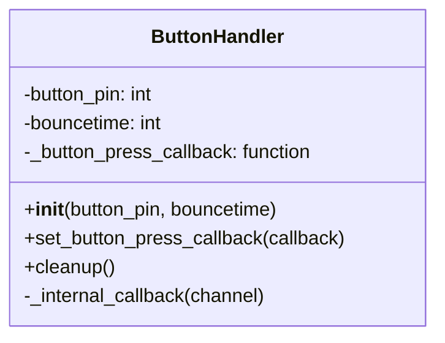

# 物理ボタンハンドラ (`ButtonHandler`) 設計書

## 1. 概要

本ドキュメントは、物理ボタンの押下を検知する`ButtonHandler`クラスの設計について記述する。
このクラスは、開発ロードマップのタスク「[P1-1.1.1] 物理ボタンの押下を検知するスクリプトを作成」に対応する。

## 2. 目的

Raspberry PiのGPIOピンに接続された物理ボタンの押下イベントを抽象化し、アプリケーションの他の部分がハードウェアを意識することなく、ボタン押下というイベントを簡単に利用できるようにする。

## 3. クラス設計

### 3.1. クラス名

`ButtonHandler`

### 3.2. 責務

- 指定されたGPIOピンを監視する。
- ボタンのチャタリング（短時間のON/OFFの繰り返し）を防止する。
- ボタンが押された際に、あらかじめ登録されたコールバック関数を呼び出す。
- スクリプト終了時に、GPIOリソースを適切に解放する。

### 3.3. パブリックインターフェース



| メソッド/プロパティ | 引数 | 戻り値 | 説明 |
| :--- | :--- | :--- | :--- |
| `__init__(self, button_pin, bouncetime)` | `button_pin` (int): BCMモードのGPIOピン番号。<br>`bouncetime` (int): チャタリング防止時間(ms)。 | `None` | コンストラクタ。GPIOの初期設定を行う。 |
| `set_button_press_callback(self, callback)` | `callback` (function): 登録するコールバック関数。 | `None` | ボタン押下時に実行される関数を登録する。 |
| `cleanup(self)` | `None` | `None` | GPIOリソースを解放する。 |

### 3.4. 依存ライブラリ

- `RPi.GPIO`: Raspberry PiのGPIOピンを操作するためのライブラリ。

## 4. 互換性（ダミーモード）

Raspberry Pi以外の開発環境（Windows, macOSなど）でもアプリケーションのロジック部分を開発・テストできるように、互換性レイヤーを設ける。

- **実装方法:**
    1. `RPi.GPIO`のインポートを`try-except`ブロックで囲む。
    2. インポートに失敗した場合（`RuntimeError`または`ModuleNotFoundError`）、`IS_RASPBERRY_PI`フラグを`False`に設定する。
    3. `RPi.GPIO`ライブラリの主要な関数や定数を模倣した`MockGPIO`クラスを定義する。このクラスのメソッドは、ハードウェアを操作する代わりに、実行しようとした内容をコンソールに出力する。
    4. `IS_RASPBERRY_PI`が`False`の場合、グローバルな`GPIO`変数を`MockGPIO`のインスタンスで上書きする。

- **利点:**
    - `ButtonHandler`クラスのコードを変更することなく、Raspberry Piとそれ以外の環境の両方で動作させることができる。
    - ハードウェアがなくても、ボタン押下イベントに続くロジックのテストが容易になる。

## 5. 使用例

```python
from hardware.button_handler import ButtonHandler
import time

def my_button_action():
    print("ボタンが押されました！録音を開始します。")

# ハンドラを初期化
button_handler = ButtonHandler(button_pin=17)

# 実行したい関数を登録
button_handler.set_button_press_callback(my_button_action)

print("ボタンの押下を待っています...")

# メインループ
try:
    while True:
        time.sleep(1)
except KeyboardInterrupt:
    print("終了します。")
finally:
    button_handler.cleanup()
```
