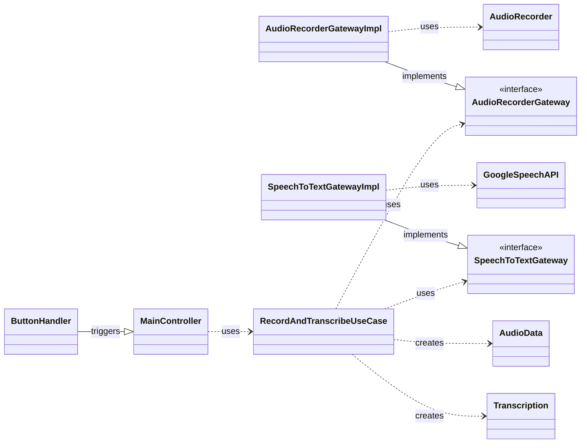
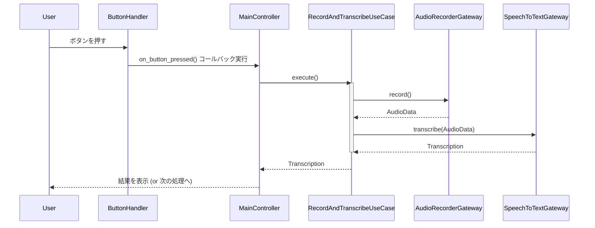

# クリーンアーキテクチャ設計書

## 1. 概要

本ドキュメントは、NotiGenieアプリケーションの基本構造となるクリーンアーキテクチャに基づいたディレクトリ構造と、主要なクラスのひな形について設計する。
この設計は、開発ロードマップのタスク「[P1-1.2.1] クリーンアーキテクチャに基づいたディレクトリ構造と、主要なクラスのひな形を作成」に対応する。

## 2. 目的

メンテナンス性、テスト容易性、交換可能性の高いソフトウェア構造を確立する。
関心事を分離し、ビジネスロジック（ドメイン）をフレームワークやUI、DBなどの技術的詳細から独立させる。

## 3. ディレクトリ構造

`src`ディレクトリ配下を、クリーンアーキテクチャの各層に対応する形で構成する。

```
src/
├── adapter/                # 変換層: 内外のデータを変換するアダプタ
│   ├── controllers/        # 入力変換: UIやCLIからの入力をユースケースが分かる形式に
│   ├── gateways/           # 出力変換: DBや外部APIとの通信を抽象化
│   └── presenters/         # 出力変換: ユースケースの結果をUIが表示できる形式に
├── domain/                 # 中心層: アプリケーションの核となるビジネスロジック
│   ├── entities/           # ビジネスオブジェクトの定義
│   └── use_cases/          # アプリケーション固有のビジネスルール
├── frameworks/             # 最外層: フレームワークやドライバ（具体的な実装）
│   └── hardware/           # (既存)ハードウェア操作の実装
├── main.py                 # アプリケーションのエントリポイント、依存関係の注入
└── poc/                    # (既存)技術検証用のスクリプト置き場
```

## 4. 各層の責務とクラス設計

（中略）

## 5. 依存性のルール

- **内側に向かって依存:** 外側の層は内側の層を知っているが、内側の層は外側の層を知らない。
- **依存性逆転の法則:** `domain.use_cases`は具体的な実装（Gateway）に依存せず、インターフェース（抽象）に依存する。具体的な実装は`main.py`で注入（DI: Dependency Injection）する。

## 6. クラス図



## 7. シーケンス図（ボタン押下から文字起こしまで）

