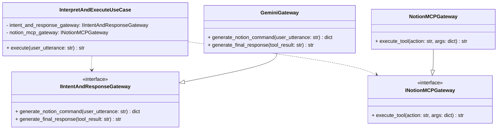
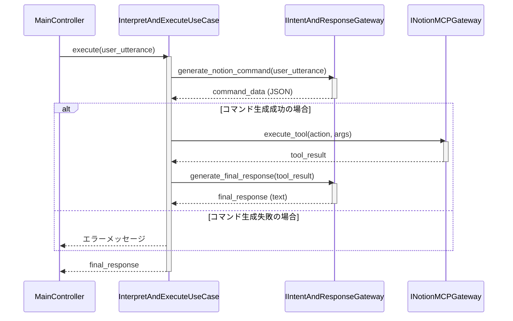

# ユースケース「Interpret and Execute」設計書

## 1. 概要

本ドキュメントは、ユーザーの音声指示を解釈し、適切なNotion操作を実行して結果を返すためのユースケース「Interpret and Execute」の設計について記述する。
このユースケースは、アプリケーションのコアロジックとして、Geminiとの連携とNotionMCPのツール実行を統括する。

## 2. 目的

- ユーザーの自然言語による指示から、Notion操作の実行、そして自然言語での応答生成までの一連のフローをカプセル化する。
- クリーンアーキテクチャの原則に基づき、ビジネスロジック（ユースケース）と外部サービス（ゲートウェイ）を明確に分離する。
- メンテナンス性とテスト容易性の高い構造を実現する。

## 3. クラス図

## 4. シーケンス図

## 5. 各コンポーネントの責務

### 5.1. `InterpretAndExecuteUseCase` (Use Case)

- **責務:** アプリケーションのコアなビジネスロジックを実行する。
- **詳細:**
    1.  `IIntentAndResponseGateway`を呼び出し、ユーザーの発話からNotion操作のJSONコマンドを生成する。
    2.  生成されたコマンドを解析し、`action`と`args`を抽出する。
    3.  `INotionMCPGateway`を呼び出し、抽出した`action`と`args`でNotionツールを実行する。
    4.  ツールの実行結果を`IIntentAndResponseGateway`に渡し、ユーザーへの最終的な応答メッセージを生成させる。
    5.  最終的な応答メッセージを呼び出し元（コントローラー）に返す。

### 5.2. `IIntentAndResponseGateway` / `GeminiGateway` (Interface Adapter)

- **責務:** 意図解釈と応答生成のためのLLM APIとの通信をカプセル化する。
- **詳細:**
    -   `generate_notion_command`: `notion_command_generator.md`プロンプトを読み込み、`config.yaml`のデータベース概要を埋め込み、ユーザーの発話からJSONコマンドを生成する。
    -   `generate_final_response`: NotionMCPの実行結果を基に、ユーザーへの自然な応答メッセージを生成する。

### 5.3. `INotionMCPGateway` / `NotionMCPGateway` (Interface Adapter)

- **責務:** NotionMCPサーバーとの通信をカプセル化する。
- **詳細:**
    -   `execute_tool`: アプリケーションからのツール実行要求を受け取り、NotionMCPサーバーを呼び出す。
    -   `config.yaml`から読み込んだマッピング情報を基に、`database_name`や`parent_name`といった論理名を実際のデータベースIDに変換する責務も持つ。

## 6. 考慮事項

-   **インターフェースの導入:** `IIntentAndResponseGateway`と`INotionMCPGateway`というインターフェース（抽象基底クラス）を導入することで、依存性逆転の原則（DIP）を適用し、ユースケースが具象クラス（`GeminiGateway`, `NotionMCPGateway`）に依存しないようにする。
    -   **補足:** `INotionMCPGateway`は「Notion」という固有名詞を含んでいますが、本アプリケーションの核となる目的が「Notionを操作すること」であるため、過剰な抽象化を避け、役割の明確さを優先する現実的な選択としています。
-   **設定情報の注入:** `config.yaml`から読み込んだデータベースのマッピング情報は、DI（Dependency Injection）コンテナなどを通じて`NotionMCPGateway`に注入されるのが望ましい。
-   **エラーハンドリング:** 各ゲートウェイでのAPIエラーや通信エラーは、例外として捕捉され、ユースケース層で適切に処理される必要がある。
