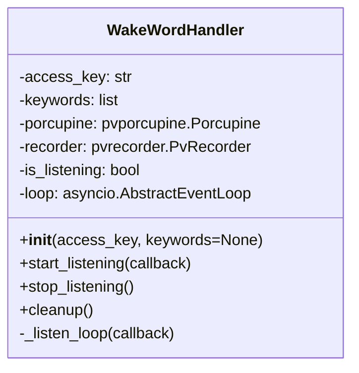

# ウェイクワードハンドラ (`WakeWordHandler`) 設計書

## 1. 概要

本ドキュメントは、Picovoice Porcupineを使用してウェイクワード（例：「Porcupine」）の検知を行う`WakeWordHandler`クラスの設計について記述する。
このクラスは、物理ボタンによる起動に代わり、音声によるハンズフリー起動を実現する。

## 2. 目的

マイクからの音声入力を常時監視し、特定のウェイクワードが発話されたことを検知して、アプリケーションのメイン処理（録音とコマンド実行）をトリガーする。

## 3. クラス設計

### 3.1. クラス名

`WakeWordHandler`

### 3.2. 責務

- Picovoice Porcupineエンジンの初期化と管理。
- マイク入力（`pvrecorder`を使用）の制御。
- 音声ストリームの処理とウェイクワード検知。
- ウェイクワード検知時のコールバック実行。
- リソースの適切な解放。

### 3.3. パブリックインターフェース



| メソッド/プロパティ | 引数 | 戻り値 | 説明 |
| :--- | :--- | :--- | :--- |
| `__init__(self, access_key, keywords=None)` | `access_key` (str): Picovoice AccessKey。<br>`keywords` (list): 検知するキーワードのリスト（デフォルトはNoneで標準キーワードを使用）。 | `None` | コンストラクタ。PorcupineとRecorderの初期化を行う。 |
| `start_listening(self, callback)` | `callback` (function): ウェイクワード検知時に実行する関数。 | `None` | 音声監視を開始する。別スレッドでループを実行する。 |
| `stop_listening(self)` | `None` | `None` | 音声監視を停止する。 |
| `cleanup(self)` | `None` | `None` | PorcupineとRecorderのリソースを解放する。 |

### 3.4. 依存ライブラリ

- `pvporcupine`: ウェイクワード検知エンジン。
- `pvrecorder`: 音声入力ライブラリ。

## 4. 非同期処理とスレッドモデル

`pvporcupine.process()` および `pvrecorder.read()` はブロッキング処理であるため、メインの `asyncio` イベントループをブロックしないように、検知ループは別のスレッド（`threading.Thread`）で実行する。

検知時のコールバックが非同期関数（コルーチン）の場合は、`asyncio.run_coroutine_threadsafe` を使用してメインループにスケジュールする。同期関数の場合は、`loop.call_soon_threadsafe` を使用する。

## 5. 使用例

```python
from hardware.wakeword_handler import WakeWordHandler
import asyncio
import os

async def on_wake_word_detected():
    print("ウェイクワードを検知しました！")
    # ここで録音などの処理を開始

async def main():
    access_key = os.getenv("PICOVOICE_ACCESS_KEY")
    handler = WakeWordHandler(access_key=access_key)

    # 監視開始
    handler.start_listening(on_wake_word_detected)

    # アプリケーションのメインループ
    try:
        await asyncio.Event().wait()
    finally:
        handler.cleanup()
```
