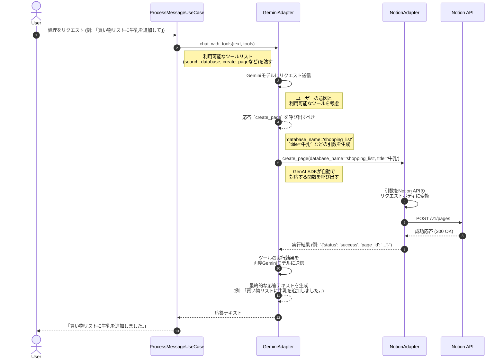

# Function Calling (ツール) 設計書

## 1. 概要
本システムは、Google Gemini APIの **Function Calling** (別名: Tools) 機能を利用して、LLM(大規模言語モデル)が単なるテキスト応答だけでなく、具体的なアクションを実行できるように設計されています。

LLMはユーザーの発話を解釈し、事前定義されたツール（Python関数）の中から最適なものを選択し、必要な引数（パラメータ）を生成します。アプリケーション側は、その情報に基づいて関数を実行し、結果を再びLLMに渡して最終的な応答を生成させます。これにより、単なる会話に留まらない動的なアプリケーション連携が可能になります。

## 2. 提供ツールとNotion APIの対応関係
`NotionAdapter` がLLMに提供するツールは以下の通りです。これらのツールが、Notion APIの各エンドポイントに対応しています。

| ツール名 (`function`) | 説明 | Notion API アクション | HTTPメソッド | エンドポイント |
|:---|:---|:---|:---:|:---|
| `search_database` | Notionデータベース内のページを検索する。 | Query a database | `POST` | `/v1/databases/{database_id}/query` |
| `create_page` | Notionデータベースに新しいページを作成する。 | Create a page | `POST` | `/v1/pages` |
| `update_page` | 既存のNotionページのプロパティを更新する。 | Update page properties | `PATCH` | `/v1/pages/{page_id}` |
| `append_block` | 既存のNotionページにコンテンツブロックを追加する。 | Append block children | `PATCH` | `/v1/blocks/{block_id}/children` |

## 3. Function Callingのシーケンス図
ユーザーからのリクエストを受けてから、実際にNotion APIが呼び出されるまでの処理の流れを以下に示します。

## 4. 各ツールの詳細なパラメータ

### 4.1. `search_database`
- **目的**: データベース内を検索し、特定の条件に一致するページの情報を取得する。更新対象のページIDを特定する際などに使用される。
- **パラメータ**:
    - `database_name` (str, 必須): 検索対象のデータベース名（例: `todo_list`）。
    - `query` (str, オプション): ページタイトルに含まれるキーワードでフィルタリングする。
    - `filter_conditions` (str, オプション): JSON形式の文字列で、プロパティに基づいた高度なフィルタリングを行う (例: `{"status": "In progress"}` )。

### 4.2. `create_page`
- **目的**: 新しいアイテム（タスク、買い物リストの項目など）をデータベースに追加する。
- **パラメータ**:
    - `database_name` (str, 必須): 作成先のデータベース名。
    - `title` (str, 必須): 新規ページのタイトル。
    - `properties` (str, オプション): JSON形式の文字列で、タイトル以外のプロパティ（期限、カテゴリなど）を設定する。

### 4.3. `update_page`
- **目的**: 既存のページの情報を変更する（例: タスクのステータスを「完了」にする）。
- **パラメータ**:
    - `page_id` (str, 必須): 更新対象のページID。通常、`search_database` で事前に特定する。
    - `properties` (str, 必須): JSON形式の文字列で、更新したいプロパティと新しい値を指定する。

### 4.4. `append_block`
- **目的**: 既存のページにメモや詳細情報を追記する。
- **パラメータ**:
    - `page_id` (str, 必須): 追記対象のページID。
    - `content` (str, 必須): 追加するコンテンツのテキスト。
