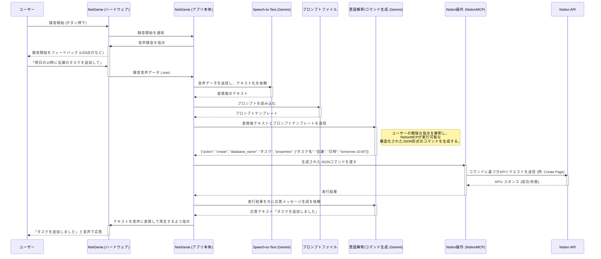

# 音声指示によるNotion操作のシーケンス図

このドキュメントは、音声指示をトリガーとしてNotionのCRUD操作を行うアプリケーションの全体的な動作フローをシーケンス図で示します。
特に、ユーザーの意図を解釈する`Gemini API`と、Notionとの通信を行う`NotionMCP`の連携に焦点を当てています。

このアーキテクチャは、AI（考える部分）と具体的な処理（実行する部分）を分離する「関心の分離」の原則に基づいており、メンテナンス性と拡張性を高めることを目的としています。

## シーケンス図 (Mermaid)

## 各コンポーネントの役割

- **ユーザー**: アプリケーションに音声で指示を出す。
- **NotiGenie (ハードウェア)**: Raspberry Pi上の物理インターフェース。ボタン、マイク、スピーカーなどを制御する。
- **NotiGenie (アプリ本体)**: 全体の処理フローを制御するコアアプリケーション。
- **Speech-to-Text (Gemini)**: 受け取った音声データをテキストに変換する。
- **プロンプトファイル**: Geminiに与える指示（プロンプト）を管理する外部ファイル。コードと分離することで、迅速な改善サイクルを可能にする。
- **意図解釈/コマンド生成 (Gemini)**: 「頭脳」の役割。ユーザーの曖昧な自然言語を解釈し、NotionMCPが実行できる厳密な**構造化された命令（JSON）**を生成する。
- **NotionMCP**: 「手足」の役割。Geminiから**構造化された命令**を受け取り、Notion APIとの実際の通信を代行する。APIの技術的な詳細を隠蔽し、アプリケーションの他の部分をシンプルに保つ。
- **Notion API**: Notionデータベースの実際のCRUD操作を行うエンドポイント。

## 連携を成功させるための重要ポイント

このアーキテクチャを効果的に機能させるためには、以下の3つのポイントが重要です。

1.  **明確な命令フォーマット(JSON)の定義**: GeminiとNotionMCP間の「共通言語」となるJSONの仕様を厳密に定義します。`action`, `database_name`, `properties`などのフィールドを含み、誰が見ても操作内容が理解できるようにすることが成功の鍵です。

2.  **効果的なプロンプト設計と外部ファイル化**: Geminiが定義通りのJSONを出力するよう「教育」するためのプロンプトを設計します。このプロンプトは、役割、フォーマット定義、具体例（Few-shot）を含み、改善を繰り返すために**コードベースから分離された外部ファイルとして管理する**ことが強く推奨されます。

3.  **堅牢なNotionMCPの実装**: NotionMCPは、受け取ったJSONを検証し、データベース名のマッピングを行い、Notion APIとの通信エラーを適切に処理する責務を持ちます。これにより、システム全体の安定性が保たれます。