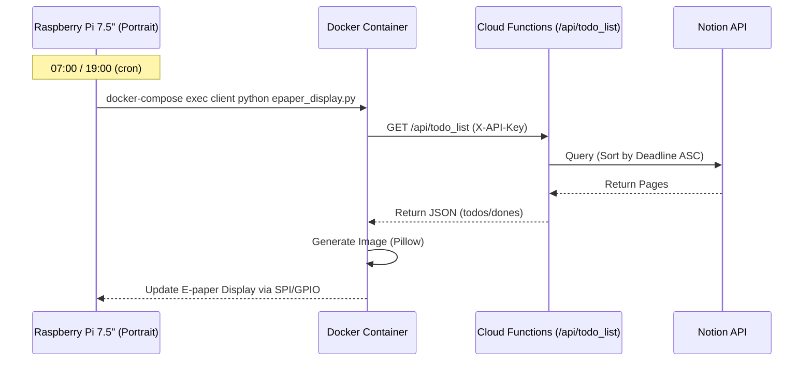

# E-paper ToDoリスト機能 仕様書

## 1. 概要

Raspberry Pi (7.5inch E-paper) に、Notion上のToDoリストを表示するための機能です。
Cloud FunctionsでNotionデータを整形し、Raspberry Piから定期的に取得・描画します。

## 2. ハードウェア & 表示要件

- **デバイス**: 7.5インチ E-paper (800x480)
- **向き**: **縦向き使用 (480x800)**
- **更新頻度**: 朝 07:00 / 夜 19:00 (Cronで制御)

## 3. Notion データベース定義

(Firestoreに定義され、API経由で取得されます)

| プロパティ名               | 型           | 用途                                                                                                                                                                  |
| :------------------------- | :----------- | :-------------------------------------------------------------------------------------------------------------------------------------------------------------------- |
| **名前**                   | Title        | タスク名                                                                                                                                                              |
| **完了ボタン**             | **Checkbox** | **[完了判定用]**<br>チェックを入れたら完了とみなす（以前のStatusプロパティは廃止）。                                                                                  |
| **期限 (Deadline)**        | **Date**     | **[システムソート用]**<br>「2月中」→ `2026-02-28` のようにシステムが解釈できる日付を設定。<br>期限が近い順のソートに使用。                                            |
| **期限表示 (DisplayDate)** | **Text**     | **[表示用]**<br>「2月中」「来週のどこか」など、ユーザーの言葉をそのまま表示。                                                                                         |
| **完了日 (DoneDate)**      | **Date**     | **[フィルタ用]**<br>完了にした日付。直近3日分の完了タスク抽出に使用。<br>AIがタスク完了時に、「今日の日付」を自動入力する。                                           |
| **メモ (Memo)**            | **RichText** | **[AI補完用]**<br>タスクに関する補足情報やリサーチ結果。<br>AIがタスク登録時に、必要に応じてWeb検索等を行い、有益な情報（例: イベント情報、レシピ等）を自動記入する。 |

## 4. システム構成



## 5. API仕様

- **Endpoint**: `/api/todo_list`
- **Method**: `GET`
- **Header**: `X-API-Key: {NOTIGENIE_API_KEY}`
- **Response**:

```json
{
  "query_date": "2026-01-30",
  "todos": [
    {
      "name": "タスク名",
      "deadline": "2026-02-28",
      "display_date": "2月中",
      "memo": "AIによるリサーチ結果..."
    }
  ],
  "dones": [
    {
      "name": "完了タスク名",
      "done_date": "2026-01-29"
    }
  ]
}
```

## 6. 実装上の注意 (Implementation Notes)

- **日本語フォント**: Docker環境では `fonts-noto-cjk` を使用。
- **Waveshareライブラリ**: `pip` で入らないため、`git clone` して `setup.py install` する方式を採用。
- **AI自動リサーチ**: Gemini Grounding (`google_search_retrieval`) を使用して `Memo` 欄を埋める。
